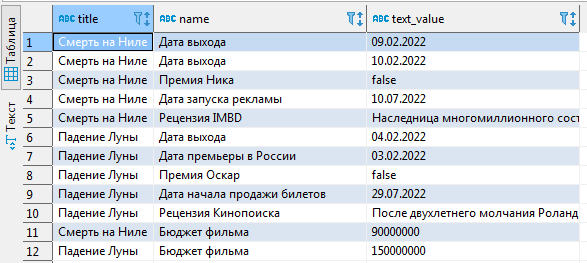

# Домашнее задание «EAV модель»

Цель:  Потренироваться в написании сложных SQL-запросов поверх схемы для проверки правильности структуры.
Усилить схему гибким хранением значений различного типа без нарушения нормализации.

## Описание реализации:

Модель реализуется на примере базы данных фильмов. Сами фильмы хранятся в таблице **films**, значение свойств хранятся в таблице **attr_values**, а описания типов атрибутов содержится в таблице **attributes**.

Тип атрибута задается в поле ENUM:

```sql
CREATE TYPE public."attr_type" AS ENUM (
	'text',
	'date',
	'bool',
	'float');
```

Наглядно схема хранения представлена на рисунке:


DDL схема приведена в отдельном файле.

Для работы с данными были сделаны несколько представлений. 

Первое выбирает важные данные в ближайшие 20 дней:

```sql
CREATE OR REPLACE VIEW public.future_dates
AS SELECT f.title, a.name, v.date_value
   FROM films f
   LEFT JOIN attr_values v ON v.film_id = f.id
   LEFT JOIN attributes a ON a.id = v.attr_id
  WHERE v.date_value >= now() AND v.date_value <= ('now'::text::date + '20 days'::interval);
```

Второе просто выбирает все доступные фильмы и свойства:

```sql
CREATE OR REPLACE VIEW public.all_props
AS SELECT f.title, a.name, 
        CASE
            WHEN a.type = 'text'::attr_type THEN v.text_value
            WHEN a.type = 'date'::attr_type THEN to_char(v.date_value::timestamp with time zone, 'DD.MM.YYYY'::text)
            WHEN a.type = 'bool'::attr_type THEN v.bool_value::text
            WHEN a.type = 'float'::attr_type THEN v.float_val::text
            ELSE NULL::text
        END AS text_value
   FROM films f
   LEFT JOIN attr_values v ON v.film_id = f.id
   LEFT JOIN attributes a ON a.id = v.attr_id;
```

Пример выборки всех свойтв:


